# Nexora Platform Architecture

> Comprehensive architecture documentation covering system context, monorepo structure, data model, and backend platform conventions.

---

## Table of Contents

1. [C4 System Context](#c4-system-context)
2. [Phase 1 — Architecture Foundation](#phase-1--architecture-foundation)
3. [Phase 2 — Data Model & Persistence](#phase-2--data-model--persistence)
4. [Phase 2 — Logical ERD](#phase-2--logical-erd)
5. [Phase 3 — Backend Platform](#phase-3--backend-platform)

---

## C4 System Context

### System

Nexora is a SaaS platform for brands and agencies to publish, schedule, analyze, and collaborate across multiple social networks from a unified premium web experience.

### External Actors

- Marketing teams and social managers
- Agency operators and approvers
- Finance and workspace administrators
- Social network APIs: Meta, LinkedIn, X
- Payment provider: Razorpay
- Email provider and future notification channels

### Primary Containers

- React web app
- API gateway
- Domain microservices
- PostgreSQL, Redis, RabbitMQ, object storage, and search infrastructure

### Key Relationship

The web app communicates only through the API gateway. The gateway routes versioned tenant-scoped requests to downstream services, while domain services exchange asynchronous events through RabbitMQ and rely on dedicated data stores in later phases.

---

## Phase 1 — Architecture Foundation

### Objective

Phase 1 creates the production-oriented repository foundation for Nexora without collapsing the system into a monolith. The outcome is a coherent monorepo that supports the React web application, eight Spring Boot services, shared contracts, local dependency infrastructure, CI validation, and cloud-ready deployment assets.

### Monorepo Shape

- `apps/web`: marketing site and authenticated product shell
- `packages/contracts`: cross-service and frontend contract definitions
- `packages/ui`: shared premium UI primitives
- `services/*`: independently bootable Spring Boot service templates
- `infra/docker`: container build assets
- `infra/k8s`: Kustomize base and local overlays
- `infra/terraform/aws`: AWS environment and platform module scaffold

### Runtime Boundaries

- `api-gateway`: single public ingress for `/api/v1`
- `auth-service`: authentication, sessions, and token lifecycle
- `user-service`: users, workspaces, membership, and RBAC
- `social-integration-service`: provider connectors and OAuth/webhooks
- `post-scheduler-service`: drafts, scheduling, approvals, and publish orchestration
- `analytics-service`: ingestion, reporting, and listening read models
- `notification-service`: in-app and email/event notifications
- `billing-service`: plans, subscriptions, and entitlements

### Local Dependency Baseline

- PostgreSQL for transactional state
- Redis for caching, rate-limits, and future queue coordination
- RabbitMQ for asynchronous workflows
- MinIO for S3-compatible object storage development
- Mailpit for email workflow validation
- OpenSearch as an optional local profile for listening/search phases

### Phase 1 Non-Goals

- No persistence schema yet
- No auth or RBAC implementation yet
- No live social provider integrations yet
- No billing logic yet
- No production AWS resources provisioned yet

---

## Phase 2 — Data Model & Persistence

### Persistence Strategy

Nexora remains microservices-first. In production, each service can own its own PostgreSQL database. In local development and early environments, the platform uses a single PostgreSQL instance with one schema per service:

- `auth_service`
- `user_service`
- `social_service`
- `scheduler_service`
- `analytics_service`
- `notification_service`
- `billing_service`

The API Gateway remains stateless and owns no persistence.

### Tenancy Model

- Global user data lives only in `auth_service`.
- Workspace-owned operational data lives in the owning service schema and carries `workspace_id`.
- Analytics and listening tables are workspace-scoped read models and do not act as system-of-record sources for auth or scheduling.
- Cross-service references are logical only. IDs are shared across services, but database-level foreign keys do not cross service schemas.

### Service Table Ownership

#### Auth Service
- `user_identities`
- `auth_methods`
- `refresh_sessions`
- `verification_challenges`

#### User Service
- `workspaces`
- `roles`
- `role_permissions`
- `workspace_memberships`
- `workspace_invites`
- `approval_routes`
- `approval_route_steps`
- `audit_entries`

#### Social Integration Service
- `connected_accounts`
- `account_capabilities`
- `webhook_subscriptions`
- `inbound_inbox_events`

#### Post Scheduler Service
- `media_assets`
- `content_templates`
- `post_drafts`
- `draft_asset_links`
- `post_variants`
- `approval_requests`
- `approval_decisions`
- `scheduled_jobs`
- `publish_attempts`
- `import_batches`

#### Analytics Service
- `watch_queries`
- `account_daily_metrics`
- `content_daily_metrics`
- `workspace_rollups`
- `listening_mentions`
- `report_exports`

#### Notification Service
- `notification_templates`
- `notification_preferences`
- `notifications`
- `delivery_attempts`

#### Billing Service
- `plans`
- `subscriptions`
- `invoices`
- `payment_events`
- `entitlement_snapshots`
- `usage_counters`

### Isolation Rules

- Every mutable workspace-domain table includes `workspace_id`, except global auth and system catalog tables.
- User IDs are generated in auth and propagated as opaque UUID references to other services.
- Plan gating reads from billing entitlement snapshots, not directly from invoices or provider webhooks.
- Audit trails are written to `user_service.audit_entries` as the central workspace audit feed.

---

## Phase 2 — Logical ERD

```mermaid
erDiagram
  user_identities ||--o{ auth_methods : owns
  user_identities ||--o{ refresh_sessions : opens
  user_identities ||--o{ verification_challenges : requests

  workspaces ||--o{ roles : defines
  workspaces ||--o{ workspace_memberships : contains
  roles ||--o{ role_permissions : grants
  workspaces ||--o{ workspace_invites : issues
  workspaces ||--o{ approval_routes : configures
  approval_routes ||--o{ approval_route_steps : sequences
  roles ||--o{ approval_route_steps : targets
  workspaces ||--o{ audit_entries : records

  connected_accounts ||--o{ account_capabilities : exposes
  connected_accounts ||--o{ webhook_subscriptions : subscribes
  connected_accounts ||--o{ inbound_inbox_events : ingests

  media_assets ||--o{ draft_asset_links : attaches
  post_drafts ||--o{ draft_asset_links : uses
  post_drafts ||--o{ post_variants : customizes
  post_drafts ||--o| approval_requests : submits
  approval_requests ||--o{ approval_decisions : captures
  post_drafts ||--o| scheduled_jobs : schedules
  scheduled_jobs ||--o{ publish_attempts : retries
  workspaces ||--o{ import_batches : imports

  watch_queries ||--o{ listening_mentions : matches
  workspaces ||--o{ account_daily_metrics : aggregates
  workspaces ||--o{ content_daily_metrics : tracks
  workspaces ||--o{ workspace_rollups : rolls_up
  workspaces ||--o{ report_exports : exports

  notification_templates ||--o{ notifications : renders
  notifications ||--o{ delivery_attempts : delivers
  workspaces ||--o{ notification_preferences : configures

  plans ||--o{ subscriptions : prices
  subscriptions ||--o{ invoices : bills
  subscriptions ||--o{ payment_events : receives
  subscriptions ||--o{ entitlement_snapshots : materializes
  workspaces ||--o{ usage_counters : meters
```

---

## Phase 3 — Backend Platform

Phase 3 standardizes the Spring Boot foundation for all Nexora microservices so later feature work can build on shared behavior instead of repeating infrastructure code in each service.

### Shared Java Modules

- `packages/java/nexora-platform-core`
  - shared service and messaging configuration properties
  - request context and header conventions
  - service metadata, error, and messaging DTOs
- `packages/java/nexora-platform-webmvc-starter`
  - OpenAPI setup for servlet-based services
  - correlation ID filter and request context exposure
  - common REST error envelope
  - standard system endpoints
- `packages/java/nexora-platform-webflux-starter`
  - reactive equivalents for the gateway
  - correlation ID propagation for routed requests
  - standard reactive system endpoints
- `packages/java/nexora-platform-messaging-starter`
  - RabbitMQ topic exchange, durable queue, and binding setup
  - event publisher abstraction
  - in-memory last-consumed snapshot for smoke verification

### Standard System Endpoints

Every service now exposes:

- `GET /api/v1/system/info`
- `GET /api/v1/system/request-context`
- `GET /api/v1/system/messaging/status`
- `GET /api/v1/system/messaging/last-consumed`
- `POST /api/v1/system/messaging/publish`

The API Gateway additionally exposes:

- `GET /api/v1/system/services/catalog`

### Runtime Conventions

- Correlation IDs use `X-Correlation-Id`
- Tenant request context headers use:
  - `X-Nexora-User-Id`
  - `X-Nexora-Workspace-Id`
  - `X-Nexora-Scopes`
- Messaging is disabled by default for local unit tests and enabled explicitly in Docker Compose
- RabbitMQ bindings use one queue per service with the routing key pattern `service.<service-name>`
- Logging patterns include correlation and trace fields for easier request stitching during local smoke tests
